# EduDock Architecture Graph

```mermaid
graph TB
    %% ═══════════════════════════════════════════════════
    %% ENTRY POINT
    %% ═══════════════════════════════════════════════════
    ENTRY["index.html<br/>Root HTML Shell"]

    %% ═══════════════════════════════════════════════════
    %% BUILD TOOLING
    %% ═══════════════════════════════════════════════════
    subgraph BUILD["⚙️ Build Tooling"]
        VITE["vite.config.ts<br/>(Vite 5, SWC, @ alias, lovable-tagger)"]
        TAILWIND["tailwind.config.ts<br/>(shadcn/ui theme + animations)"]
        POSTCSS["postcss.config.js"]
        ESLINT["eslint.config.js<br/>(TS + React Hooks + Refresh)"]
        TSCONFIG["tsconfig.json<br/>tsconfig.app.json<br/>tsconfig.node.json"]
        VITEST["vitest.config.ts"]
        PLAYWRIGHT["playwright.config.ts"]
    end

    ENTRY --> VITE

    %% ═══════════════════════════════════════════════════
    %% APP ENTRY
    %% ═══════════════════════════════════════════════════
    subgraph APP_ENTRY["🚀 Application Entry"]
        MAIN["src/main.tsx<br/>createRoot → render(App)"]
        CSS["src/index.css<br/>(Tailwind directives + CSS vars)"]
    end

    VITE --> MAIN
    MAIN --> APP["src/App.tsx<br/><b>Provider Composition Root</b>"]

    %% ═══════════════════════════════════════════════════
    %% PROVIDER STACK
    %% ═══════════════════════════════════════════════════
    subgraph PROVIDERS["🧩 Provider Stack (wraps entire app)"]
        HELMET["HelmetProvider<br/>(react-helmet-async)"]
        THEME["ThemeProvider<br/>(next-themes)"]
        QUERY["QueryClientProvider<br/>(@tanstack/react-query)"]
        TOOLTIP["TooltipProvider<br/>(Radix)"]
        TOASTER["<Toaster/><br/>(sonner)"]
        ROUTER["BrowserRouter<br/>(react-router-dom v6)"]
        ERROR_BOUNDARY["ErrorBoundary"]
        SUSPENSE["<Suspense/>"]
    end

    APP --> HELMET --> THEME --> QUERY --> TOOLTIP --> TOASTER --> ROUTER --> ERROR_BOUNDARY --> SUSPENSE

    %% ═══════════════════════════════════════════════════
    %% ANALYTICS TRACKER
    %% ═══════════════════════════════════════════════════
    ANALYTICS["AnalyticsTracker<br/>records page_views on path change"]
    ROUTER --> ANALYTICS

    %% ═══════════════════════════════════════════════════
    %% ROUTES
    %% ═══════════════════════════════════════════════════
    subgraph ROUTES["🗺️ Routes"]
        direction TB
        PUB_LAYOUT["<PublicLayout/><br/>Navbar + Footer + Search + Outlet"]
        HOME["/ → Home.tsx (lazy)"]
        TOOLS["/tools → Tools.tsx (lazy)"]
        PDFS["/pdfs → Pdfs.tsx (lazy)"]
        PDFS_SLUG["/pdfs/:slug → Pdfs.tsx (detail view)"]
        UPDATES["/updates → Updates.tsx (lazy)"]
        UPDATES_SLUG["/updates/:slug → UpdateDetail.tsx (lazy)"]
        PRIVACY["/privacy → Privacy.tsx (lazy)"]
        TERMS["/terms → Terms.tsx (lazy)"]
        ADMIN["/admin/content → ContentManager.tsx (lazy)"]
        NOT_FOUND["* → NotFound.tsx (lazy)"]
    end

    SUSPENSE --> PUB_LAYOUT
    PUB_LAYOUT --> HOME
    PUB_LAYOUT --> TOOLS
    PUB_LAYOUT --> PDFS
    PUB_LAYOUT --> PDFS_SLUG
    PUB_LAYOUT --> UPDATES
    PUB_LAYOUT --> UPDATES_SLUG
    PUB_LAYOUT --> PRIVACY
    PUB_LAYOUT --> TERMS
    SUSPENSE --> ADMIN
    SUSPENSE --> NOT_FOUND

    %% ═══════════════════════════════════════════════════
    %% SUPABASE BACKEND
    %% ═══════════════════════════════════════════════════
    subgraph BACKEND["☁️ Supabase Backend"]
        direction TB
        CLIENT["client.ts<br/>(createClient from @supabase/supabase-js)"]
        TYPES["types.ts<br/>(Database type definitions)"]
        DELETION["deletion.ts<br/>(deleteUpdate, deletePdf, deleteTool)"]
        
        subgraph DB["🗄️ PostgreSQL Database"]
            CATEGORIES_T["categories<br/>(id, name, entity_type)"]
            TOOLS_T["tools<br/>(id, title, url, clicks, category_id → categories)"]
            PDFS_T["pdfs<br/>(id, title, slug, clicks, category_id → categories)"]
            UPDATES_T["updates<br/>(id, title, slug, content, clicks, schema_markup)"]
            PAGE_VIEWS_T["page_views<br/>(id, path, created_at)"]
            ANALYTICS_T["analytics<br/>(id, page, visitor_count, month, year)"]
        end
        
        subgraph STORAGE["📦 Storage"]
            IMAGES_BUCKET["images bucket<br/>(public read, auth write)"]
        end
        
        subgraph FUNCTIONS["⚡ Edge Functions"]
            OG_META["og-meta/index.ts<br/>(OG image generation)"]
            SITEMAP["sitemap.xml.ts"]
            SHARE_REDIRECT["share/[[path]].js<br/>(redirect handler)"]
        end
        
        ENV["VITE_SUPABASE_URL<br/>VITE_SUPABASE_PUBLISHABLE_KEY"]
    end

    CLIENT --> TYPES
    CLIENT --> ENV
    CLIENT --> DB
    CLIENT --> STORAGE
    DELETION --> CLIENT

    %% ═══════════════════════════════════════════════════
    %% PAGES → BACKEND DATA FLOW
    %% ═══════════════════════════════════════════════════
    HOME -.->|useQuery| CLIENT
    TOOLS -.->|useQuery| CLIENT
    PDFS -.->|useQuery| CLIENT
    PDFS_SLUG -.->|useQuery| CLIENT
    UPDATES -.->|useQuery| CLIENT
    UPDATES_SLUG -.->|useQuery| CLIENT
    ADMIN -.->|useQuery + deletion| CLIENT
    ADMIN -.->|deleteUpdate/deletePdf/deleteTool| DELETION

    %% ═══════════════════════════════════════════════════
    %% CUSTOM HOOKS
    %% ═══════════════════════════════════════════════════
    subgraph HOOKS["🪝 Custom Hooks (data layer)"]
        USE_TOOLS["useTools.ts<br/>(paginated, trending, byCategory)"]
        USE_PDFS["usePdfs.ts<br/>(paginated, trending, new, byCategory)"]
        USE_UPDATES["useUpdates.ts<br/>(paginated, trending, new)"]
        USE_DEBOUNCED["useDebouncedSearch.ts<br/>(debounced search input)"]
        USE_MOBILE["use-mobile.tsx<br/>(responsive breakpoint)"]
        USE_TOAST_HOOK["use-toast.ts<br/>(toast utilities)"]
    end

    HOME --> USE_TOOLS
    HOME --> USE_PDFS
    HOME --> USE_UPDATES
    TOOLS --> USE_TOOLS
    PDFS --> USE_PDFS
    UPDATES --> USE_UPDATES
    PUB_LAYOUT --> USE_DEBOUNCED
    USE_TOOLS -.->|supabase| CLIENT
    USE_PDFS -.->|supabase| CLIENT
    USE_UPDATES -.->|supabase| CLIENT

    %% ═══════════════════════════════════════════════════
    %% SHARED UI COMPONENTS
    %% ═══════════════════════════════════════════════════
    subgraph UI["🎨 shadcn/ui Components (Radix + Tailwind)"]
        direction LR
        BUTTON["button.tsx"]
        CARD["card.tsx"]
        INPUT["input.tsx"]
        DIALOG["dialog.tsx"]
        SHEET["sheet.tsx"]
        DROPDOWN["dropdown-menu.tsx"]
        TABS["tabs.tsx"]
        BADGE["badge.tsx"]
        SKELETON["skeleton.tsx"]
        TOOLTIP_UI["tooltip.tsx"]
        TOAST_UI["toast.tsx / toaster.tsx / sonner.tsx"]
        AVATAR["avatar.tsx"]
        BREADCRUMB["breadcrumb.tsx"]
        CAROUSEL["carousel.tsx"]
        CHART["chart.tsx"]
        FORM["form.tsx"]
        SELECT["select.tsx"]
        TABLE["table.tsx"]
        PAGINATION["pagination.tsx"]
        PROGRESS["progress.tsx"]
        SEPARATOR["separator.tsx"]
        ACCORDION["accordion.tsx"]
        ALERT["alert.tsx / alert-dialog.tsx"]
        CHECKBOX["checkbox.tsx"]
        COLLAPSIBLE["collapsible.tsx"]
        COMMAND["command.tsx (cmdk)"]
        CONTEXT_MENU["context-menu.tsx"]
        DRAWER["drawer.tsx (vaul)"]
        HOVER_CARD["hover-card.tsx"]
        INPUT_OTP["input-otp.tsx"]
        LABEL["label.tsx"]
        MENUBAR["menubar.tsx"]
        NAV_MENU["navigation-menu.tsx"]
        POPOVER["popover.tsx"]
        RADIO_GROUP["radio-group.tsx"]
        RESIZABLE["resizable.tsx"]
        SCROLL_AREA["scroll-area.tsx"]
        SIDEBAR["sidebar.tsx"]
        SLIDER["slider.tsx"]
        SWITCH["switch.tsx"]
        TOGGLE["toggle.tsx / toggle-group.tsx"]
        ASPECT_RATIO["aspect-ratio.tsx"]
    end

    %% ═══════════════════════════════════════════════════
    %% APPLICATION COMPONENTS
    %% ═══════════════════════════════════════════════════
    subgraph APP_COMPONENTS["🧱 Application Components"]
        PUB_LAYOUT_COMP["PublicLayout.tsx<br/>(Desktop Nav + Mobile Tab Bar + Search + Footer)"]
        NAV_LINK["NavLink.tsx"]
        TOOL_CARD["ToolCard.tsx"]
        THEME_TOGGLE["ThemeToggle.tsx"]
        THEME_PROVIDER["ThemeProvider.tsx"]
        OPT_IMAGE["OptimizedImage.tsx"]
        PARTICLE_BG["ParticleBackground.tsx"]
        ERROR_BD["ErrorBoundary.tsx"]
        
        subgraph HOME_COMPONENTS["🏠 Home Page Sections"]
            HERO_SECTION["HeroSection.tsx"]
            TRENDING_SECTION["TrendingSection.tsx"]
        end
        
        subgraph ADMIN_COMPONENTS["🔧 Admin"]
            CONTENT_MGR["ContentManager.tsx<br/>(CRUD Dashboard)"]
            CONTENT_SECTION["ContentSection.tsx<br/>(Generic list section)"]
            DELETE_MODAL["DeleteConfirmationModal.tsx"]
        end
        
        subgraph UPDATE_COMPONENTS["📰 Update Detail"]
            TOC["TableOfContents.tsx"]
            SOCIAL_SHARE["SocialShare.tsx"]
        end
    end

    PUB_LAYOUT --> PUB_LAYOUT_COMP
    HOME --> HOME_COMPONENTS
    HOME --> TOOL_CARD
    HOME --> PARTICLE_BG
    TOOLS --> TOOL_CARD
    ADMIN --> ADMIN_COMPONENTS
    UPDATES_SLUG --> UPDATE_COMPONENTS
    PDFS --> OPT_IMAGE

    %% ═══════════════════════════════════════════════════
    %% TYPES
    %% ═══════════════════════════════════════════════════
    subgraph TYPES_BOX["📐 TypeScript Types"]
        APP_TYPES["src/types/index.ts<br/>(Update, Tool, Pdf, Category, PageView, Analytics,<br/>ApiResponse, PaginatedResponse, SearchResult, User)"]
        DB_TYPES["src/integrations/supabase/types.ts<br/>(Database, Tables, TablesInsert, TablesUpdate)"]
    end

    APP_TYPES -.->|used by| HOOKS
    APP_TYPES -.->|used by| APP_COMPONENTS
    DB_TYPES --> CLIENT

    %% ═══════════════════════════════════════════════════
    %% LIB
    %% ═══════════════════════════════════════════════════
    subgraph LIB["📚 Library Utilities"]
        UTILS["lib/utils.ts<br/>(cn() - clsx + tailwind-merge)"]
    end

    UTILS --> UI
    UTILS --> APP_COMPONENTS

    %% ═══════════════════════════════════════════════════
    %% PUBLIC / STATIC ASSETS
    %% ═══════════════════════════════════════════════════
    subgraph PUBLIC["🌐 Public Assets"]
        FAVICON["favicon.svg"]
        HERO_IMG["hero-image.png"]
        SOCIAL_IMG["social.png"]
        ROBOTS["robots.txt"]
        SITEMAP_XML["sitemap.xml"]
        REDIRECTS["_redirects"]
        PLACEHOLDER["placeholder.svg"]
    end

    %% ═══════════════════════════════════════════════════
    %% EXTERNAL DEPENDENCIES (not exhaustive)
    %% ═══════════════════════════════════════════════════
    subgraph EXTERNAL["📦 Key External Dependencies"]
        REACT["react + react-dom 18"]
        ROUTER_LIB["react-router-dom 6"]
        TANSTACK["@tanstack/react-query 5"]
        FRAMER["framer-motion 12"]
        RADIX["@radix-ui/* (30+ primitives)"]
        REACT_MD["react-markdown + remark/rehype plugins"]
        LUCIDE["lucide-react (icons)"]
        RHF["react-hook-form + zod"]
        SUPABASE_JS["@supabase/supabase-js 2"]
        RECHARTS["recharts"]
        NEXT_THEMES["next-themes"]
        HELMET_LIB["react-helmet-async"]
        SONNER_LIB["sonner (toast)"]
        CVA["class-variance-authority"]
        CMDK["cmdk (command palette)"]
        EMBLA["embla-carousel-react"]
        DATE_FNS["date-fns"]
        INPUT_OTP_LIB["input-otp"]
        VAUL["vaul (drawer)"]
    end

    APP --> REACT
    UI --> RADIX
    UI --> CVA

    %% ═══════════════════════════════════════════════════
    %% DATA FLOW SUMMARY
    %% ═══════════════════════════════════════════════════
    subgraph DATA_FLOW["📊 Data Flow Pattern"]
        direction LR
        COMPONENT["React Component"]
        HOOK["Custom Hook<br/>(useTools, usePdfs, useUpdates)"]
        TQ["@tanstack/react-query<br/>(caching, staleTime, gcTime)"]
        SB["supabase client<br/>(PostgREST)"]
        PG["PostgreSQL<br/>(7 tables + RLS)"]
        
        COMPONENT -->|"imports & calls"| HOOK
        HOOK -->|"useQuery()"| TQ
        TQ -->|"queryFn"| SB
        SB -->|"REST API"| PG
        PG -->|"JSON response"| SB
        SB -->|"typed data"| TQ
        TQ -->|"cached data"| COMPONENT
    end

    %% ═══════════════════════════════════════════════════
    %% TESTING
    %% ═══════════════════════════════════════════════════
    subgraph TESTING["🧪 Testing"]
        VITEST_TEST["vitest.config.ts"]
        PLAYWRIGHT_TEST["playwright.config.ts<br/>playwright-fixture.ts"]
        EXAMPLE_TEST["src/test/example.test.ts"]
        SETUP["src/test/setup.ts"]
        HOOKS_TEST["useTools.test.ts"]
    end
```



---

## 🏗️ Architecture Overview

### **Tech Stack**
| Layer | Technology |
|---|---|
| **Framework** | React 18 + Vite 5 (SWC) |
| **Language** | TypeScript 5.8 |
| **Routing** | react-router-dom v6 (lazy-loaded routes) |
| **State/Data** | @tanstack/react-query v5 |
| **UI Kit** | shadcn/ui (Radix primitives + Tailwind CSS) |
| **Styling** | Tailwind CSS 3.4 + CSS Variables + tailwindcss-animate |
| **Animations** | framer-motion v12 |
| **Backend** | Supabase (PostgreSQL + Storage + Edge Functions) |
| **Icons** | lucide-react |
| **Forms** | react-hook-form + zod |
| **Markdown** | react-markdown + remark-gfm + rehype-slug + remark-toc |
| **SEO** | react-helmet-async (meta + JSON-LD schema) |
| **Charts** | recharts |
| **Testing** | Vitest + Playwright + @testing-library/react |

### **Database Schema (Supabase PostgreSQL)**

```
┌─────────────┐     ┌─────────────┐     ┌─────────────┐
│  categories  │     │    tools     │     │    pdfs      │
│─────────────│     │─────────────│     │─────────────│
│ id (PK)     │◄────│ category_id │     │ category_id │◄──┐
│ name        │     │ title       │     │ title       │   │
│ entity_type │     │ url         │     │ slug        │   │
└─────────────┘     │ clicks      │     │ clicks      │   │
       │            │ description │     │ description │   │
       │            │ image_url   │     │ cover_img   │   │
       │            │ favicon_url │     │ drive_link  │   │
       │            │ author_name │     │ author_name │   │
       │            │ author_avatar│    │ author_avatar│   │
       │            │ short_desc  │     │ file_type   │   │
       │            └─────────────┘     │ file_url    │   │
       │                                └─────────────┘   │
       │                                                  │
       │            ┌─────────────┐                       │
       │            │   updates    │                       │
       │            │─────────────│                       │
       └────────────│ category_id │───────────────────────┘
                    │ title       │
                    │ slug        │
                    │ content     │     ┌──────────────┐
                    │ clicks      │     │  page_views   │
                    │ image_url   │     │──────────────│
                    │ external_url│     │ id (PK)      │
                    │ schema_markup│    │ path         │
                    │ author_name │     │ created_at   │
                    │ author_avatar│    └──────────────┘
                    │ content     │
                    └─────────────┘     ┌──────────────┐
                                        │  analytics    │
                                        │──────────────│
                                        │ id (PK)      │
                                        │ page         │
                                        │ visitor_count│
                                        │ month        │
                                        │ year         │
                                        └──────────────┘
```

### **Route Structure**

```
/                          → Home.tsx (Lazy)
/tools                     → Tools.tsx (Lazy) — infinite scroll
/pdf                       → Pdfs.tsx (Lazy) — grid + infinite scroll
/pdfs/:slug                → Pdfs.tsx (detail view with sidebar)
/updates                   → Updates.tsx (Lazy) — latest 6 cards
/updates/:slug             → UpdateDetail.tsx (Lazy) — markdown + TOC
/privacy                   → Privacy.tsx (Lazy)
/terms                     → Terms.tsx (Lazy)
/admin/content             → ContentManager.tsx (Lazy) — CRUD dashboard
*                          → NotFound.tsx (Lazy)
```

### **Key Architectural Patterns**

1. **Lazy Loading**: All pages use `React.lazy()` + `<Suspense/>` for code splitting
2. **Outlet Context**: Search query flows from `PublicLayout` → pages via `useOutletContext()`
3. **Infinite Scroll**: `Tools.tsx` and `Pdfs.tsx` use `IntersectionObserver` for pagination
4. **Optimistic Click Tracking**: Click counts updated via direct Supabase `.update()` on navigation
5. **Debounced Search**: `useDebouncedSearch` hook with 300ms delay, shared across all pages
6. **RLS Security**: All database tables have Row-Level Security — public SELECT, authenticated ALL
7. **Auto `updated_at`**: PostgreSQL triggers on tools/pdfs/updates for timestamp management
8. **Dual Nav Layout**: Desktop has fixed top navbar; mobile has top bar + bottom tab bar
9. **Theme System**: `next-themes` with dark/light/system modes, persisted in localStorage
10. **Analytics**: `AnalyticsTracker` in App.tsx + session-based deduplication in PublicLayout

### **Component Dependency Tree (simplified)**

```
App.tsx
├── HelmetProvider
│   └── ThemeProvider
│       └── QueryClientProvider
│           └── TooltipProvider
│               └── Toaster (sonner)
│                   └── BrowserRouter
│                       ├── AnalyticsTracker
│                       ├── ErrorBoundary
│                       │   └── Suspense
│                       │       └── Routes
│                       │           ├── PublicLayout
│                       │           │   ├── Desktop Navbar (search + nav pills + theme toggle)
│                       │           │   ├── Mobile Top Bar (search + theme)
│                       │           │   ├── <Outlet context={searchQuery}/> → All Pages
│                       │           │   ├── Desktop Footer (privacy, terms)
│                       │           │   └── Mobile Bottom Tab Bar (4 tabs)
│                       │           └── ContentManager (admin)
│                       └── NotFound (*)
```

### **Custom Hooks - Responsibility Matrix**

| Hook | Query Keys | Features |
|---|---|---|
| [`useTools()`](src/hooks/useTools.ts:5) | `['tools', page]`, `['trending-tools']`, `['tools', 'category', id]` | Paginated, trending by clicks, category filter |
| [`usePdfs()`](src/hooks/usePdfs.ts:5) | `['pdfs', page]`, `['trending-pdfs']`, `['new-pdfs']`, `['pdfs', 'category', id]` | Paginated, trending, new (30 days), category filter |
| [`useUpdates()`](src/hooks/useUpdates.ts:5) | `['updates', page]`, `['trending-updates']`, `['new-updates']` | Paginated, trending by clicks, new |
| [`useDebouncedSearch()`](src/hooks/useDebouncedSearch.ts) | N/A (local state) | Debounce wrapper around useState, shared via Outlet context |

### **Supabase Integration Layer**

| File | Role |
|---|---|
| [`client.ts`](src/integrations/supabase/client.ts:11) | Singleton Supabase client with auth persistence |
| [`types.ts`](src/integrations/supabase/types.ts:9) | Full Database type definition (Tables, Insert, Update, Relationships) |
| [`deletion.ts`](src/integrations/supabase/deletion.ts:7) | deleteUpdate, deletePdf, deleteTool — admin-only async helpers |

### **Testing Setup**

| Tool | Config |
|---|---|
| **Vitest** | Unit + component tests with jsdom environment |
| **Playwright** | E2E tests with custom fixture |
| **React Testing Library** | Component rendering tests |